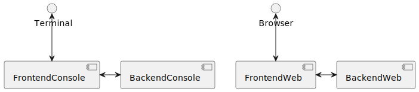
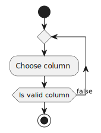
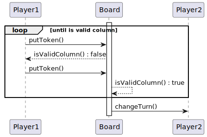
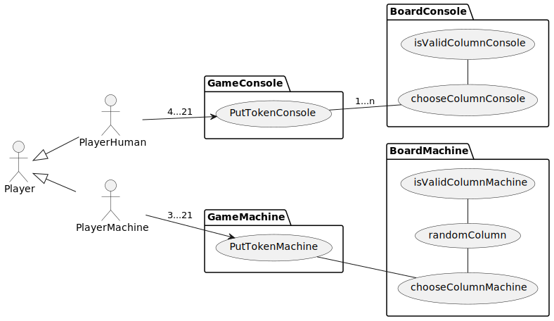
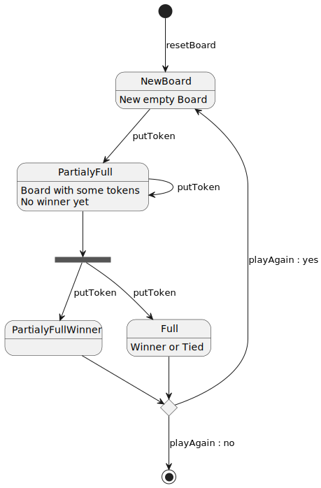

# Connect4

## Index

* [Domain Model](#Connect4)  
* [UML](#uml)

## Domain Model  

  

[WIKI](https://es.wikipedia.org/wiki/Conecta_4)

[Youtube](https://www.youtube.com/watch?v=JBSbiilzg9U)

## UML
### STRUCTURE DIAGRAMS
### Class Diagram

### Object Diagram

### Deployment Diagram

### Deployment Diagram

### STRUCTURE DIAGRAMS
### Activity Diagram

### Sequence Diagram

### Use Case Diagram

### State Diagram

