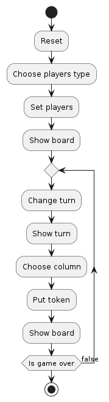
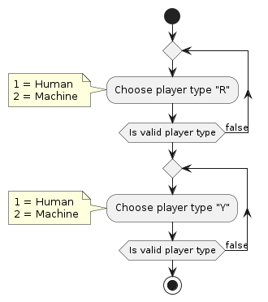

# Connect4

## index

* [Domain Model](#Connect4)  
* [UML](#uml)

## Domain Model  

  

[WIKI](https://es.wikipedia.org/wiki/Conecta_4)

[Youtube](https://www.youtube.com/watch?v=JBSbiilzg9U)

## UML
### STRUCTURE DIAGRAMS
### Class Diagram

### Object Diagram
#### Initial Objects (before first move)

#### Final Objects (before last move)

### Deployment Diagram

### Component Diagram

### COMPOSITE DIAGRAMS

### Activity Diagrams
#### Init

#### Play

#### Choose Players

#### Choose Column

### State Diagram

### Use Case Diagram
